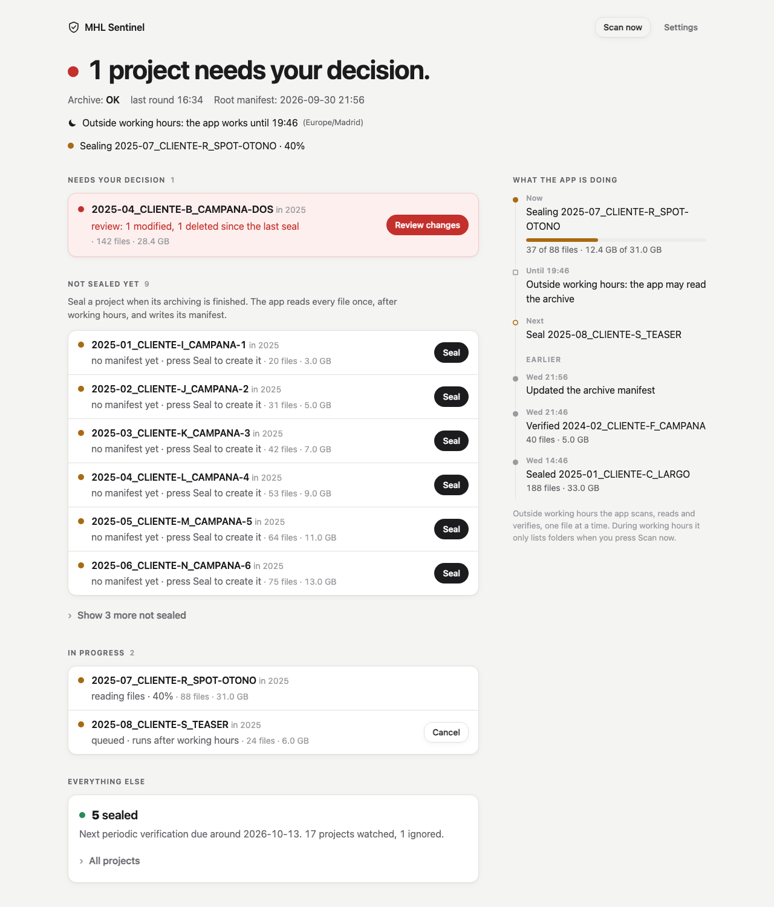
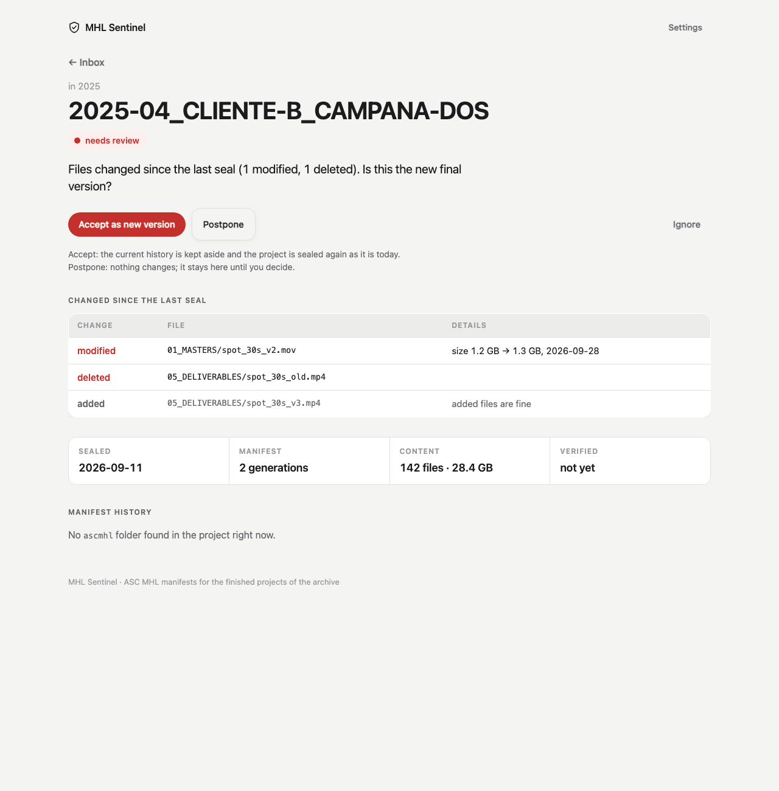
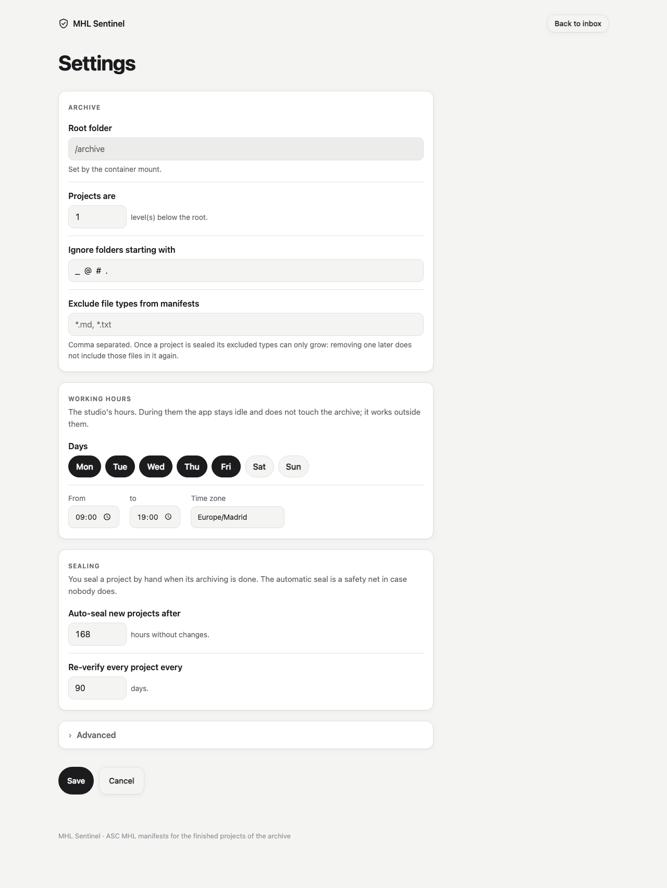

# Propuesta D — «Bandeja» (Inbox)

**TL;DR.** La pantalla principal deja de ser una lista de 95 proyectos y pasa a ser una
**bandeja de entrada**: arriba una sola frase grande que dice cómo está el archivo («1 project
needs your decision.»), debajo solo lo que pide una acción tuya (revisar, sellar, cancelar) con el
botón al lado, y todo lo demás plegado en una línea tranquila: «5 sealed · next periodic
verification due around …». A la derecha, lo que hace la app, contado como el log de transferencias
de Hedge: ahora, siguiente, antes. Color fuerte solo donde hay que decidir.

Rama: `feat/5-frontend-d` · issue #5 · capturas en `docs/propuestas/frontend-D/`.

## Qué problema de la GUI actual arregla
- **La lista plana esconde lo urgente.** Con 95 proyectos, los 2 que piden decisión son dos
  líneas más entre 95 semáforos. Aquí van primero, en una tarjeta roja, y el resto se pliega.
- **Sellar exigía dos clics y un cambio de página.** El sellado manual es lo normal (el automático
  es la red de seguridad), así que `Seal` está en la propia fila de la bandeja. `Cancel` también.
- **«Qué está haciendo la app» era una línea de texto.** Ahora es una línea de tiempo: el trabajo en
  curso con barra, cuándo acaba el horario laboral, qué va después y los últimos trabajos
  (sellados, verificados, fallos). Sale de la tabla `jobs`; no toca el NAS.
- **Pico.css daba a todo el mismo peso.** Hoja propia (~350 líneas, sin framework): grises
  neutros y color solo con significado.

## Bocetos

### Pantalla principal · escritorio (≥ 960 px)
```
 (escudo) MHL Sentinel                                   [ Scan now ]  Settings

 ●  1 project needs your decision.                      <- 44 px, el punto es rojo
    Archive: OK   last round 16:32   Root manifest: 2026-09-30 21:54
    ☾ Outside working hours: the app works until 19:00 (Europe/Madrid)
    ● Sealing 2025-07_CLIENTE-R_SPOT · 40%

 NEEDS YOUR DECISION 1                        |  WHAT THE APP IS DOING
 ┌──────────────────────────────────────────┐ |  ● Now
 │● 2025-04_CLIENTE-B_CAMPANA in 2025       │ |    Sealing 2025-07_CLIENTE-R_SPOT
 │  review: 1 modified, 1 deleted · 142 f…  │ |    ▓▓▓▓▓░░░░░  37 of 88 files
 │                       [ Review changes ] │ |  □ Until 19:00
 └──────────────────────────────────────────┘ |    Outside working hours: the app
                                              |    may read the archive
 NOT SEALED YET 9                             |  ○ Next
 Seal a project when its archiving is         |    Seal 2025-08_CLIENTE-S_TEASER
 finished. The app reads every file once…     |  EARLIER
 ┌──────────────────────────────────────────┐ |  ● Wed 21:54 Updated the archive manifest
 │● 2025-01_CLIENTE-I_CAMPANA-1      [Seal] │ |  ● Wed 21:44 Verified 2024-02_CLIENTE-F
 │  no manifest yet · press Seal · 20 files │ |              40 files · 5.0 GB
 │● 2025-02_CLIENTE-J_CAMPANA-2      [Seal] │ |  ● Wed 14:44 Sealed 2025-01_CLIENTE-C
 │  … (6 visibles)                          │ |              188 files · 33.0 GB
 └──────────────────────────────────────────┘ |
 › Show 3 more not sealed                     |
                                              |
 IN PROGRESS 2                                |
 │● 2025-07_CLIENTE-R  reading files · 40%  │ |
 │● 2025-08_CLIENTE-S  queued …    [Cancel] │ |
                                              |
 EVERYTHING ELSE                              |
 ┌──────────────────────────────────────────┐ |
 │● 5 sealed                                │ |
 │  Next periodic verification due around   │ |
 │  2026-10-13. 17 projects watched, 1 ign. │ |
 │  › All projects   [filter by name]       │ |
 └──────────────────────────────────────────┘ |
 › 1 item out of place in the archive         |
```
Con todo sellado, la frase es «All quiet. Every project is sealed.» con punto verde, y las
secciones vacías desaparecen: queda la tarjeta «Everything else» y el log.

### Pantalla principal · móvil (390 px)
```
 (escudo) MHL Sentinel   [Scan now] Settings
 ● 1 project needs
   your decision.
 Archive: OK  last round 16:32
 Root manifest: 2026-09-30 21:54
 ☾ Outside working hours: the app
   works until 19:00
 ● Sealing 2025-07_… · 40%

 NEEDS YOUR DECISION 1
 ┌──────────────────────────┐
 │● 2025-04_CLIENTE-B_…     │
 │  review: 1 modified, …   │
 │  [ Review changes ]      │
 └──────────────────────────┘
 NOT SEALED YET 9
 │● 2025-01_CLIENTE-I_…     │
 │  no manifest yet · …     │
 │  [Seal]                  │
 › Show 3 more not sealed
 IN PROGRESS 2 …
 EVERYTHING ELSE …
 WHAT THE APP IS DOING       <- el log baja al final
```

### Detalle de proyecto · escritorio
```
 ← Inbox                                                       Settings
 in 2025
 2025-04_CLIENTE-B_CAMPANA-DOS                            <- 40 px
 (● needs review)
 Files changed since the last seal (1 modified, 1 deleted).
 Is this the new final version?

 [ Accept as new version ]  [ Postpone ]                         Ignore
 Accept: the current history is kept aside and the project is sealed
 again as it is today. Postpone: nothing changes; it stays here until you decide.

 CHANGED SINCE THE LAST SEAL
 ┌ CHANGE ──── FILE ─────────────────────────── DETAILS ─────────────────┐
 │ modified    01_MASTERS/spot_30s_v2.mov       size 1.2 GB → 1.3 GB, …  │
 │ deleted     05_DELIVERABLES/spot_30s_old.mp4                          │
 │ added       05_DELIVERABLES/spot_30s_v3.mp4  added files are fine     │
 └───────────────────────────────────────────────────────────────────────┘
 ┌ SEALED ───────┬ MANIFEST ──────┬ CONTENT ────────────┬ VERIFIED ─────┐
 │ 2026-09-11    │ 2 generations  │ 142 files · 28.4 GB │ not yet       │
 └───────────────┴────────────────┴─────────────────────┴───────────────┘
 MANIFEST HISTORY
 ● Generation 2  current
 │ 2026-09-11 10:02 · 142 files · ascmhl
 ● Generation 1
   2026-03-10 09:40 · 138 files · ascmhl
 Each generation is one ASC MHL manifest in the project's ascmhl folder.
```
Sin JS el botón hace POST y la página vuelve a cargar; con JS solo se cambia la tarjeta.
Según el estado cambian la frase y los botones: `Seal` (sin manifiesto), `Cancel` (Seal o Accept
en cola, D53), `Unignore`. La verificación periódica fallida sustituye la tabla de cambios por
la de resultados (`corrupt`, `missing`…).

### Detalle de proyecto · móvil
```
 ← Inbox
 in 2025
 2025-04_CLIENTE-
 B_CAMPANA-DOS
 (● needs review)
 Files changed since the last
 seal (1 modified, 1 deleted).
 [Accept as new version] [Postpone]
 Ignore
 CHANGED SINCE THE LAST SEAL
 modified
 01_MASTERS/spot_30s_v2.mov
 size 1.2 GB → 1.3 GB, …        <- la tabla se apila en tarjetas
 ┌ SEALED ─────┬ MANIFEST ────┐
 │ 2026-09-11  │ 2 generations│
 ├ CONTENT ────┼ VERIFIED ────┤
 └─────────────┴──────────────┘
 MANIFEST HISTORY …
```

### Ajustes · escritorio (mismo contenido y orden que el boceto aprobado D45)
```
 (escudo) MHL Sentinel                                   [ Back to inbox ]
 Settings
 ┌ ARCHIVE ─────────────────────────────────────────────┐
 │ Root folder        [/archive              ] (gris)   │
 │ Projects are       [1] level(s) below the root.      │
 │ Ignore folders starting with  [_ @ # .]              │
 │ Exclude file types from manifests [*.md, *.txt]      │
 └──────────────────────────────────────────────────────┘
 ┌ WORKING HOURS ───────────────────────────────────────┐
 │ The studio's hours. During them the app stays idle…  │
 │ Days  (Mon)(Tue)(Wed)(Thu)(Fri) ( Sat )( Sun )       │
 │ From [09:00]  to [19:00]  Time zone [Europe/Madrid]  │
 └──────────────────────────────────────────────────────┘
 ┌ SEALING ─────────────────────────────────────────────┐
 │ You seal a project by hand… safety net…              │
 │ Auto-seal new projects after [168] hours …           │
 │ Re-verify every project every [90] days.             │
 └──────────────────────────────────────────────────────┘
 › Advanced
 [ Save ]  [ Cancel ]                           <- barra fija abajo
```
En móvil, las mismas tarjetas a ancho completo; los días son píldoras que saltan de línea.

## Color, tipografía y semáforos
- **Grises neutros** (sin tinte azul ni cálido), como una sala de etalonaje: así cualquier color
  en pantalla significa algo. Modo oscuro automático si el Mac está en oscuro.
- **Rojo** = te toca decidir (tarjeta y botón `Review changes` / `Accept`). **Ámbar** = espera o
  se mueve (en cola, leyendo, sin sellar). **Verde** = sellado, solo como punto pequeño. **Gris
  hueco** = ignorado. Son los mismos semáforos de la arquitectura (verde/ámbar/rojo/gris).
- Tipografía del sistema (San Francisco en Mac), titular de 28–44 px, rutas en monoespaciada,
  números tabulares para horas y tamaños.
- El punto del trabajo en curso «respira» despacio (se apaga con «reducir movimiento»).

## Modelo de interacción
- **En vivo (SSE, sin recargar):** la frase de arriba (fin de ronda, trabajos, archivo OK/KO,
  cambio de estado de proyecto, raíz), la bandeja (`project.state`, `cycle.finished`), el log
  (trabajos, progreso cada 3 s) y, en el detalle, la tarjeta y la barra.
- **Un clic:** `Seal` y `Cancel` en la bandeja (vuelves a la bandeja con el aviso «… Seal
  requested»). Como los botones no publican eventos, la respuesta lleva `HX-Trigger:
  inbox-changed` y la frase y el log se refrescan solos.
- **Requiere entrar al detalle:** `Accept`, `Postpone` e `Ignore`. Aceptar una versión nueva sin
  ver qué cambió es justo el error que la app quiere evitar.
- **Sin JavaScript:** todos los botones son formularios; la bandeja redirige a `/` y el detalle a
  su página. Plegables con `<details>`. El JS propio (`sentinel.js`, 60 líneas) solo añade el
  filtro por nombre, mantiene abiertos los plegables al refrescar y muestra el motivo de un 409.
- **Archivo inaccesible:** la frase pasa a rojo «The archive is not reachable.» con una
  explicación; la bandeja muestra lo último que la app sabía (sale de la DB) y el log dice
  «Waiting for the archive to answer». Las entradas fuera de sitio no se consultan.

## Cambios técnicos (contrato intacto)
- Rutas, JSON, eventos SSE y `sealer.request_*` sin tocar. Nuevo: fragmento
  `GET /fragments/activity` y el parámetro `?from=inbox` en los POST de botones.
- `views.py`: `inbox()`, `headline()`, `activity()`, `detail_sentence()`, `next_verification()`.
- Fuera `pico.min.css`; dentro `sentinel.css` y `sentinel.js` propios (`static/README.md`).
- Tests de `test_web.py` adaptados al marcado nuevo, más dos: botones de la bandeja y log.

## Trade-offs y lo que dejé fuera a propósito
- **«Seal all» no existe.** Con 95 proyectos sin sellar tienta, pero sellar es decir «este
  proyecto está cerrado», y eso es proyecto a proyecto. La bandeja enseña 6 y pliega el resto.
- **`Ignore` no está en la bandeja**, solo en el detalle: es raro y tiene confirmación.
- **«Next periodic verification» es una estimación** (el más antiguo + 90 días); el
  planificador escalona por noches y puede ir algo después. Por eso dice «around».
- **El log solo enseña trabajos**, no cada ronda de scan ni los avisos `log` del bus: sería ruido.
- **Sin buscador global**: hay filtro por nombre dentro de «All projects» (con JS).
- Con 95 proyectos sin sellar la frase grande será ámbar durante semanas mientras se sella el
  backlog; es honesto, pero conviene saberlo.

## Cómo probarlo
```sh
git switch feat/5-frontend-d
make setup && make fixtures
make run            # abre http://localhost:8080
```
Las capturas usan un archivo sintético con todos los estados:
`index-desktop.png`, `index-working-hours-desktop.png`, `index-dark-desktop.png`,
`index-phone.png`, `project-review-desktop.png`, `project-review-phone.png`,
`settings-desktop.png`, `settings-phone.png` (carpeta `docs/propuestas/frontend-D/`).




